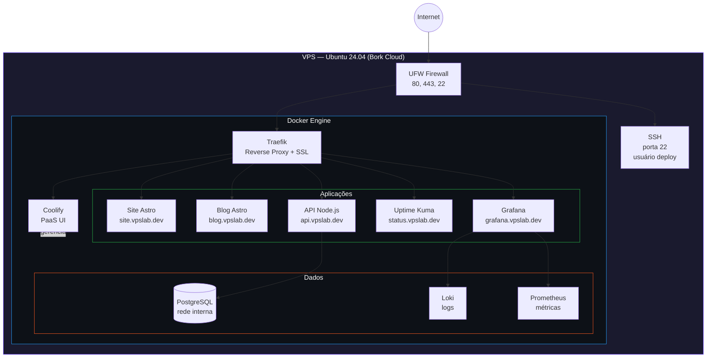

# Arquitetura — vps-lab

## Diagrama de infraestrutura



## Princípios de isolamento

- **Rede do banco de dados:** PostgreSQL exposto apenas na rede interna Docker. Nenhuma porta pública.
- **Acesso SSH:** Somente usuário `deploy` com chave Ed25519. Root bloqueado.
- **SSL:** Let's Encrypt automático via Traefik para todos os domínios.
- **Firewall:** Apenas portas 22, 80 e 443 abertas externamente.

## Fluxo de deploy

```
Push no GitHub
      │
      ▼
Coolify detecta via webhook
      │
      ▼
Build da imagem Docker
      │
      ▼
Deploy do container
      │
      ▼
Traefik roteia o domínio automaticamente
      │
      ▼
SSL emitido/renovado automaticamente
```
